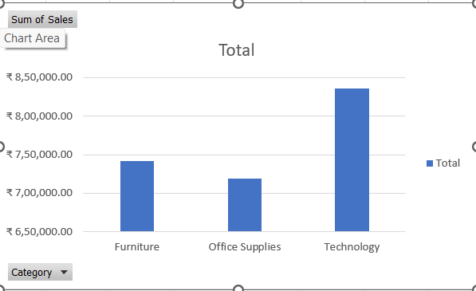
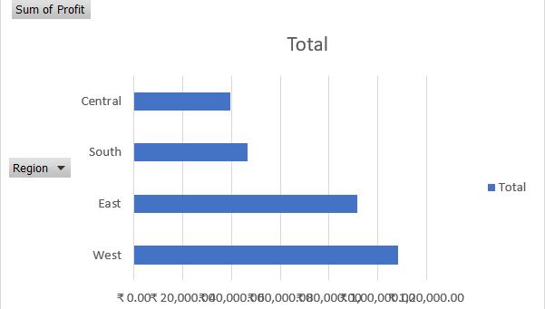
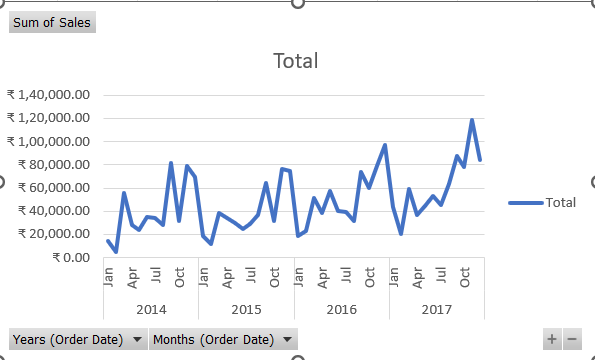
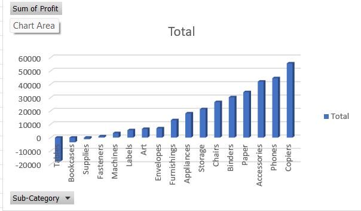

# Retail Sales Data Analysis (Excel Project)

## Project Overview
This project analyzes retail store sales performance using Microsoft Excel.

## Dataset
- Sample Superstore dataset
- 9,000+ transaction records

## Tools Used
- Microsoft Excel
- Pivot Tables
- Charts & Dashboards
- Data Cleaning

## Business Questions Answered
- What is total sales and total profit?
- Which category generates highest revenue?
- Which region is most profitable?
- What are monthly sales trends?
- Which products are causing losses?

## Key Insights
- Technology category generated highest revenue.
- Sales peak during year-end months.
- Some sub-categories produce negative profit.
- Regional performance varies significantly.

## Dashboard Screenshots

